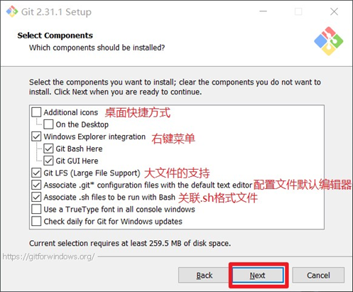
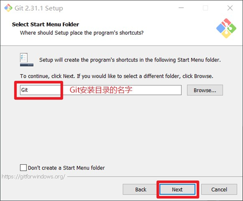
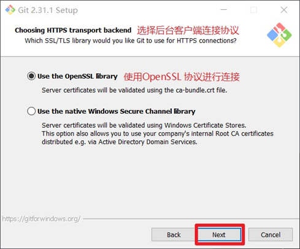
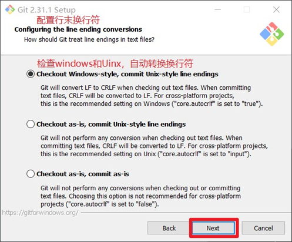
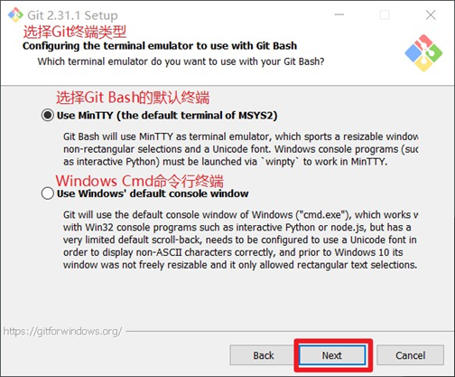
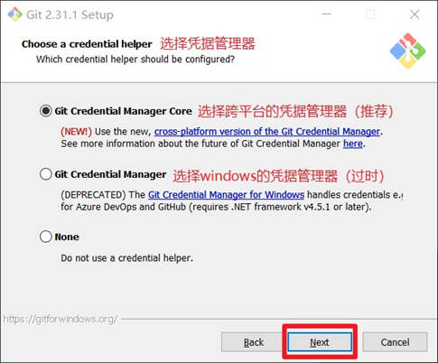
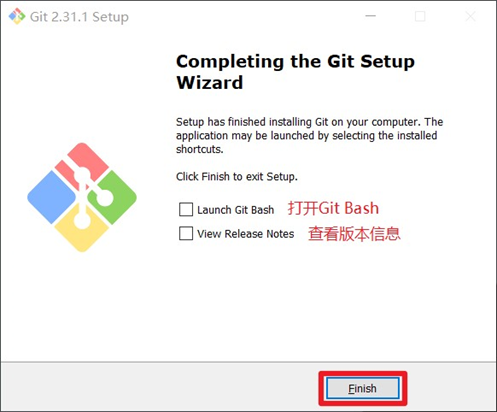

# Git 安装

官网地址：[https://git-scm.com/](https://git-scm.com/)
## ubuntu 安装git 

```shell
#安装git
sudo apt-get install git
#查看是否安装成功
git --version
```

## window 安装git

查看 GNU 协议，可以直接点击下一步


选择 Git 安装位置，要求是非中文并且没有空格的目录，然后下一步


Git 选项配置，推荐默认设置，然后下一步



Git 安装目录名，不用修改，直接点击下一步



Git 的默认编辑器，建议使用默认的 Vim 编辑器，然后点击下一步


默认分支名设置，选择让 Git 决定，分支名默认为 master，下一步


修改 Git 的环境变量，选第一个，不修改环境变量，只在 Git Bash 里使用 Git


选择后台客户端连接协议，选默认值 OpenSSL，然后下一步



配置 Git 文件的行末换行符，Windows 使用 CRLF，Linux 使用 LF，选择第一个自动转换，然后继续下一步



选择 Git 终端类型，选择默认的 Git Bash 终端，然后继续下一步



选择 Git pull 合并的模式，选择默认，然后下一步


选择 Git 的凭据管理器，选择默认的跨平台的凭据管理器，然后下一步



其他配置，选择默认设置，然后下一步


实验室功能，技术还不成熟，有已知的 bug，不要勾选，然后点击右下角的 Install 按钮，开始安装 Git


点击 Finsh 按钮，Git 安装成功！



右键任意位置，在右键菜单里选择 Git Bash Here 即可打开 Git Bash 命令行终端


在 Git Bash 终端里输入 `git --version` 查看 git 版本，如图所示，说明 Git 安装成功

